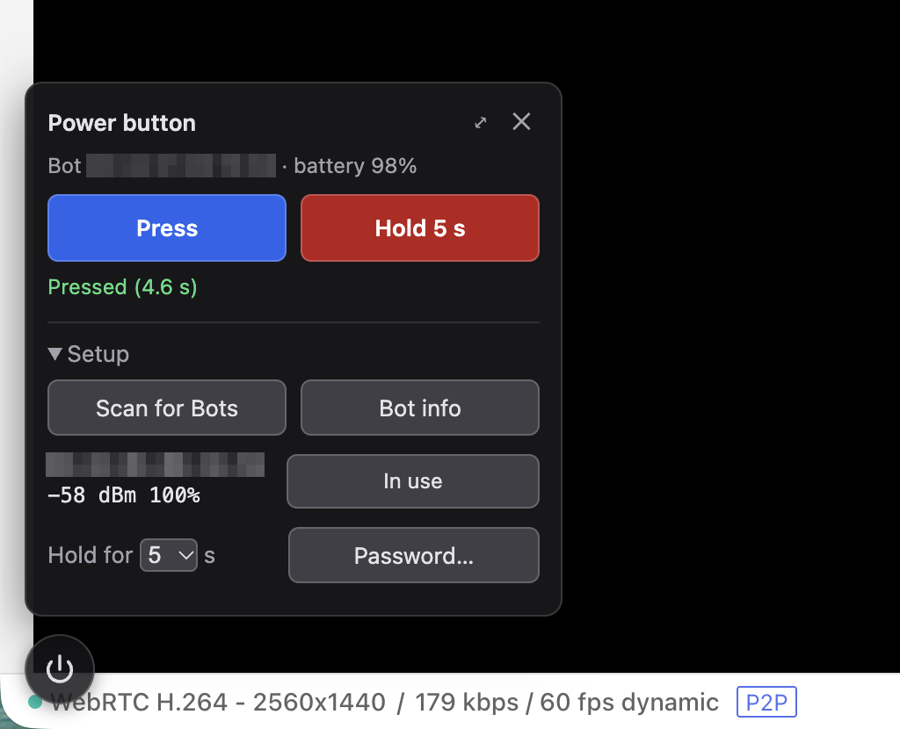

# comet-switchbot

A power button in the GL.iNet Comet (GL-RM1PE) web UI that presses a
SwitchBot Bot, for powering the machine behind the KVM on and off.



GL.iNet's web UI doesn't show kvmd's GPIO buttons, so the button is injected
into the page instead, on stock firmware. The Comet has no Bluetooth radio, so
a Linux machine with Bluetooth near the Bot drives it:

```
browser ──https──> Comet nginx ──(KVM login check)──> http://<node>:8779 ──D-Bus──> BlueZ ──BLE──> Bot
```

- `node/` — `switchbotd.py` (BlueZ over D-Bus + a token-protected HTTP API)
  and its systemd unit. It runs on any Linux host with BlueZ, or in an
  unprivileged Proxmox container that uses the host's BlueZ.
- `comet/` — the button (`ui.js`), an nginx drop-in that serves it and
  forwards `/switchbot/api/` to the node behind the Comet's login, and a boot
  hook (`S90switchbot`) that re-applies both at every boot. GL's own files
  are never modified.

Tested with a Comet PoE on firmware 1.10.1, a SwitchBot Bot on firmware 6.6,
and the node in a container on a Proxmox VE 9.1 host with an Intel AX200.

## Setup

The node needs a Bluetooth adapter within range of the Bot. `node/install.sh`
uses apt, so it expects a Debian- or Ubuntu-based system.

### Node on a Linux host

```sh
sh node/install.sh root@<node-ip>
```

It installs BlueZ if it's missing and runs `switchbotd` as a `switchbot`
system user.

### Node in a Proxmox container

Bluetooth sockets only exist in the host's network namespace, so a container
can't run its own bluetoothd. It uses the host's instead, through the host's
`/run/dbus` mounted at `/mnt/host-dbus`:

```sh
pct create 110 local:vztmpl/debian-13-standard_13.1-2_amd64.tar.zst \
  --hostname switchbot --cores 1 --memory 512 --swap 256 --rootfs local-lvm:4 \
  --net0 name=eth0,bridge=vmbr0,ip=dhcp,type=veth --features nesting=1 \
  --unprivileged 1 --onboot 1 --tags switchbot \
  --mp0 /run/dbus,mp=/mnt/host-dbus --ssh-public-keys <your key file>
pct start 110
sh node/install.sh root@<node-ip>
```

Nothing else on the host may claim the Bluetooth adapter (for example a VM
with it passed through), or the node loses it.

The host's dbus-daemon drops clients whose uid has no passwd entry, and
container uids map to host uids that don't exist (container uid 999 is host
uid 100999). After `node/install.sh` creates the `switchbot` user, give its
mapped uid an entry on the host:

```sh
groupadd --system --gid 100991 ct110-switchbot
useradd --system --uid 100999 --gid 100991 --no-create-home --home-dir /nonexistent \
  --shell /usr/sbin/nologin ct110-switchbot
```

(`pct exec 110 -- id switchbot` gives the uid and gid; add 100000 to each.)

### The Comet

```sh
sh comet/install.sh root@<comet-ip> <node-ip>
```

Give the node a fixed address (DHCP reservation); the Comet's nginx points at
it by IP. Rerun `comet/install.sh` after a Comet firmware update if the
button is gone.

In the Comet UI, the button sits in a corner (the arrow icon moves it). Open
Setup, scan, and pick the Bot. Press and Hold ask for confirmation. Hold sets
the Bot's long-press time, presses, and resets it to 0.

The Bot must be in press mode, not switch mode. If it has a password in the
SwitchBot app, set the same one under Setup.

## CLI on the node

```sh
runuser -u switchbot -- python3 /opt/switchbot/switchbotd.py scan | info | press | hold 5 | config --mac C1:23:45:67:89:AB
```

## Tests

```sh
uv venv .venv && uv pip install --python .venv/bin/python aiohttp==3.11.16 dbus_next==0.2.3
.venv/bin/python tests/test_switchbotd.py   # fake BlueZ on a private dbus-daemon
sh tests/test_nginx.sh                       # drop-in in a stock nginx container
```

## Remove

```sh
ssh root@<comet> /etc/kvmd/user/scripts/S90switchbot uninstall
```

## Related

- [GL.iNet Fingerbot](https://docs.gl-inet.com/kvm/en/user_guide/gl-fgb-01/),
  the official button pusher, with its own paired USB receiver.
- [heidrickla/glkvm-firmware](https://github.com/heidrickla/glkvm-firmware),
  which enables the classic PiKVM UI on port 8888, where kvmd GPIO buttons
  do show.
- [heidrickla/ha-glkvm](https://github.com/heidrickla/ha-glkvm) and
  [metril/ha-glinet-comet](https://github.com/metril/ha-glinet-comet), Home
  Assistant integrations for the Comet.
- [SwitchBot's BLE API](https://github.com/OpenWonderLabs/SwitchBotAPI-BLE),
  the source of the Bot command bytes used here.

## License

MIT, see [LICENSE](LICENSE).
